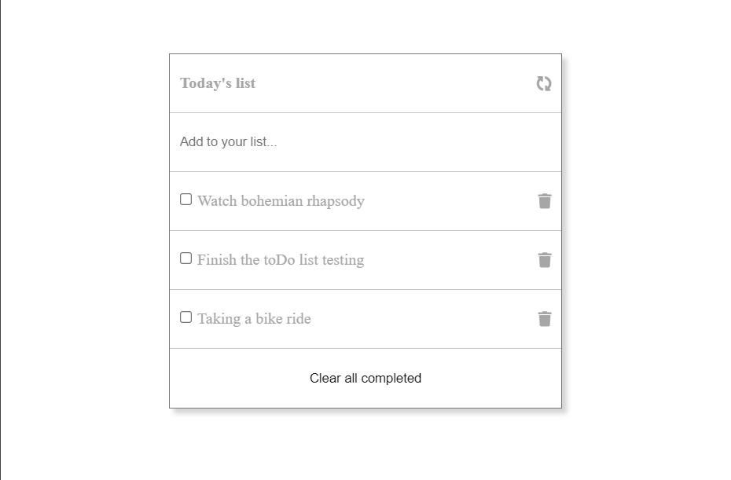

# toDoList

> This project is a presentation of working with webpack.

# Web Preview

## Built With

- HTML
- CSS
- JavaScript

## Live Demo

[Live Demo](https://chaw-bot.github.io/toDoList/dist/)

# Install Instruction
1. Open your terminal and `cd` to a proper location.
2. Clone the Repo on you computer using `git clone git@github.com:chaw-bot/toDoList.git`
3. Make sure you have JavaScript installed; use `js -v` .
4. Cd to the project directory`cd To-Do-List` .
5. Use `node -v` to check if you have node instaled
6. Install the dependencies in the local node_modules folder with `npm install`
7. Then `npm start`

## Authors

👤 **Chaw**

- GitHub: [@chaw-bot](https://github.com/chaw-bot)
- Twitter: [@chaw36422087](https://twitter.com/chaw36422087)
- LinkedIn[Chawanzi Ng'uni](https://www.linkedin.com/in/chawanzi-ng-uni-449328212/)

## 🤝 Contributing

Contributions, issues, and feature requests are welcome!

Feel free to check the [issues page](https://github.com/chaw-bot/toDoList/issues).

## Show your support

Give a ⭐️ if you like this project!

## Acknowledgments

- Hat tip to anyone whose code was used
- Inspiration
- etc

## 📝 License

This project is [MIT](...) licensed.